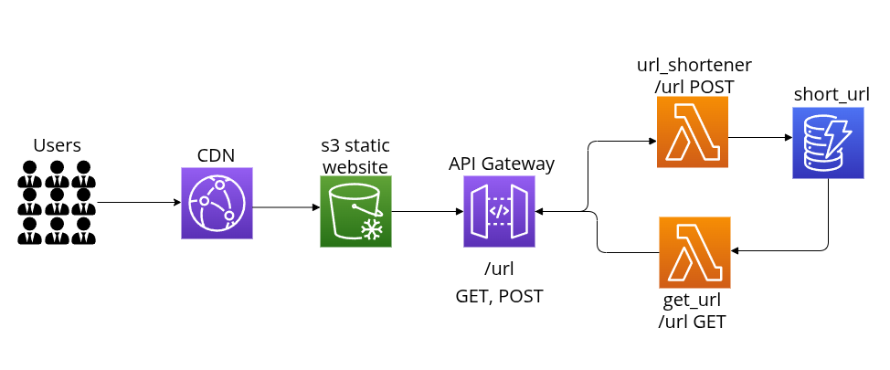

# AWS URL Shortener

This project is a simple URL shortener that deploys a stack using the AWS CDK.

### Getting started

1. First, you'll want to make sure that you have the aws cdk installed. 

    If you use `npm`, you can do a global install with: 

        npm install -g aws-cdk

2. Run `npm install` to install all packages

3. Next, build the frontend files with `npm run build:frontend`

4. If you haven't the `cdk` before, you'll need to initialize `cdk` in AWS with:

        npx run cdk bootstrap

    This will create a bucket in s3.

5. Finally, run `npm run deploy` to deploy the stack to AWS. Type `y` to confirm when prompted.

Once it is deployed, you can view the app via the `CloudFrontDistributionUrl`.
You should see it in the outputs when the deployment finishes. 

https://github.com/user-attachments/assets/50aab375-2039-4f75-95f8-52432faf581c

### Some notes

Since this app is serverless, keeping it running will not cost too much under
normal circumstances, as you will only be charged based on usage and storage.

Typically, it will probably cost you < $1 USD/month to run unless a lot of
people are using it. Storing URLs does not use a lot of space, so pretty much
all of the cost will be from usage.

If you decide to modify any of the frontend files, `npm run deploy` (or `npx
cdk deploy`) will not detect changes in the frontend. To update the frontend,
you'll need run `npm run build:frontend`, then `npm run deploy:frontend` script
which will reupload the `dist` files to s3.

In order to fully delete the stack, you will need to empty the frontend s3
bucket first, otherwise it will fail to delete.

### Architecture

